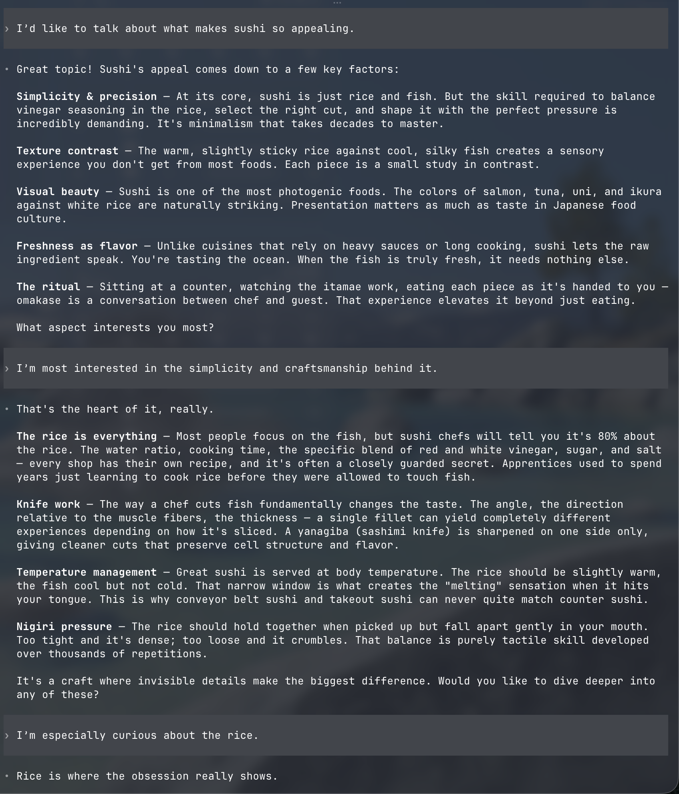
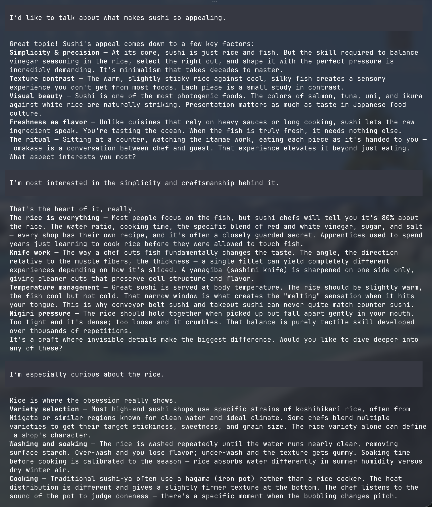
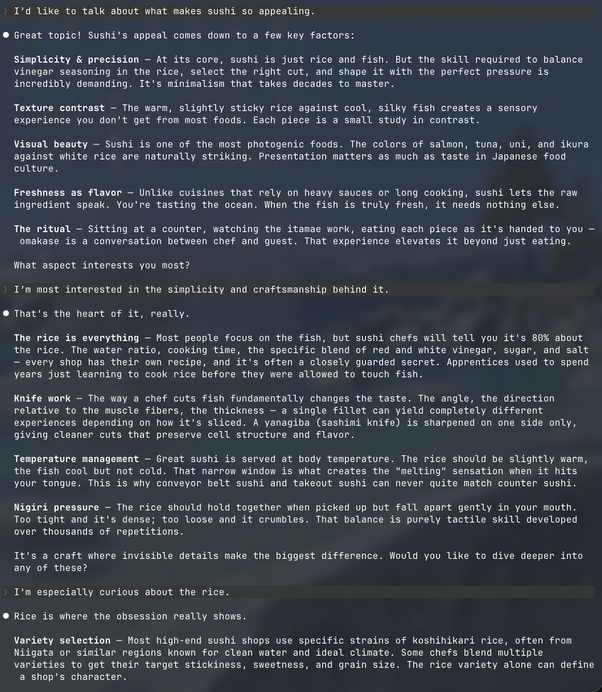

# ctxmv - A CLI tool to migrate conversation sessions between AI coding agents.

[](https://www.swift.org)
[](https://github.com/Ryu0118/ctxmv/releases/latest)
[](LICENSE)
[](https://github.com/Ryu0118/ctxmv/releases/latest)
[](https://x.com/ryu_hu03)

✨ **You no longer need to suffer through rate limits: when one coding agent hits its limit, migrate the session to another and keep going.**

| Claude Code | Codex | Cursor |
|:-:|:-:|:-:|
|  |  |  |

## Features

- 🔀 Migrate sessions between supported agents (resume-compatible)
- 📋 List sessions across all agents in a unified table
- 💬 Show conversation messages with role-colored output

### Supports

- Claude Code
- Codex
- Cursor (CLI agent via `cursor-agent`, not the GUI app)
- Kimi Code (`kimi` CLI)
- GitHub Copilot CLI (`copilot` CLI; source and target)

## Install

```bash
curl -fsSL https://raw.githubusercontent.com/Ryu0118/ctxmv/main/install.sh | bash
```

To update, run the same command. It skips the download if already up-to-date.

```bash
# Install a specific version
curl -fsSL https://raw.githubusercontent.com/Ryu0118/ctxmv/main/install.sh | VERSION=0.1.0 bash

# Force reinstall
curl -fsSL https://raw.githubusercontent.com/Ryu0118/ctxmv/main/install.sh | FORCE=1 bash
```

### Other methods

#### Nest ([mtj0928/nest](https://github.com/mtj0928/nest))

```bash
nest install Ryu0118/ctxmv
```

#### Mise ([jdx/mise](https://github.com/jdx/mise))

```bash
mise use -g github:Ryu0118/ctxmv
```

#### Build from source

Requires Swift 6.0+ and macOS 15+.

```bash
git clone https://github.com/Ryu0118/ctxmv.git
cd ctxmv
swift run ctxmv <subcommand>
```

## Usage

```bash
# Claude Code → Codex
ctxmv <session-id> --to codex

# Codex → Claude Code
ctxmv <session-id> --to claude-code

# Any → Cursor
ctxmv <session-id> --to cursor

# Any → Kimi Code
ctxmv <session-id> --to kimi-code

# Any → GitHub Copilot CLI
ctxmv <session-id> --to copilot-cli

# GitHub Copilot CLI → Codex
ctxmv <session-id> --from copilot-cli --to codex
```

Migrating to Copilot CLI requires version 1.0.85 or newer. Copilot CLI syncs sessions to GitHub by default. To keep migrated sessions local, ctxmv disables remote access and export during import and includes the same flags in the resume command; it does not change your Copilot settings.

After migration, the tool prints the resume command:

```
✅ Session written to: /path/to/session
To resume:
  cd -- '/your/project'
  codex resume <new-session-id>
```

> **Note:** Cursor may not render migrated past messages in TUI immediately after resume. However, conversation context is preserved and past messages are still available to the agent.

### List sessions

```bash
# List all sessions across all agents
ctxmv list

# Filter by agent
ctxmv list --source claude-code
ctxmv list --source codex
ctxmv list --source cursor
ctxmv list --source copilot-cli

# Filter by project path
ctxmv list --project /path/to/project

# Limit results
ctxmv list --limit 50
```

### Show session messages

```bash
# Show messages for a session (full or prefix ID)
ctxmv show <session-id>

# Restrict search to a specific agent
ctxmv show <session-id> --source claude-code
ctxmv show <session-id> --source copilot-cli

# Show raw content without compacting XML-like blocks
ctxmv show <session-id> --raw

# Show only the last N messages
ctxmv show <session-id> --limit 20

# Show all messages, bypassing large-session protection
ctxmv show <session-id> --all
```

## License

MIT
